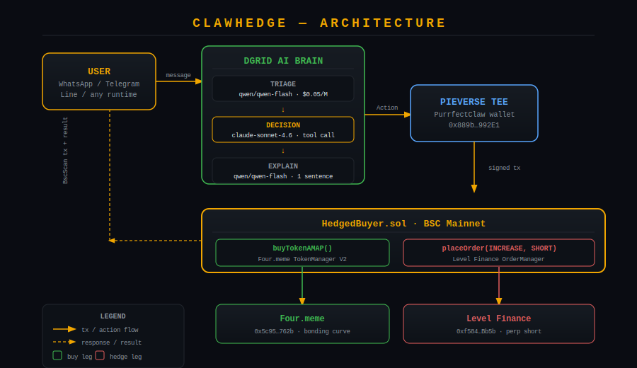

# ClawHedge
> The first hedged trading agent on Four.meme. One message. Two protocols. One atomic transaction.

---

## The gap we fill

Every hackathon entry in this category is a long-only buyer. Meme trading without a short is a casino. ClawHedge is the first agent that ships both legs atomically — Four.meme buy + Level Finance perp short in a single BSC transaction.

---

## How it works

1. User messages the agent (WhatsApp, Telegram, Line — any Pieverse runtime)
2. DGrid routes 3 Claude models: triage → decision → explain
3. Pieverse TEE wallet signs the transaction
4. One BSC tx calls Four.meme and Level Finance through our HedgedBuyer contract
5. User sees BscScan link, tokens received, short open, max-loss cap enforced on-chain

---

## Bounty coverage

| Bounty | How ClawHedge hits it | Evidence |
|---|---|---|
| Main ($50K pool) | First hedged + atomic + multi-model agent in the field | Contract + AI pipeline below |
| Pieverse ($2K) | 7 skills live on Skill Store | [Links below](#skills-pieverse-skill-store) |
| DGrid ($3K credits) | 3-stage Claude pipeline — triage / decision / explain via DGrid gateway | `agent/src/dgrid.ts` |
| Level Finance | Perp short via Level Finance OrderManager in atomic tx | `contracts/src/HedgedBuyer.sol:107` |

---

## Live artifacts

### Contract
| Item | Link |
|---|---|
| Mainnet HedgedBuyer | [`0x2084a2A9C23d9ba70f66bBEF7A91C6d202Bf478e`](https://bscscan.com/address/0x2084a2A9C23d9ba70f66bBEF7A91C6d202Bf478e) |
| Live dashboard | [clawhedge.vercel.app](https://clawhedge.vercel.app) |
| Demo video | `[YouTube link — add after recording]` |

### Mainnet transactions
| # | Tx | What it proves |
|---|---|---|
| 1 | [`0x167963...`](https://bscscan.com/tx/0x167963fb12cba5bd15a97a1c4ada8db6b749ed9a95809630243f1dde6c6a2b07) | HedgedBuyer deployed on BSC mainnet |
| 2 | [`0xb5425d...`](https://bscscan.com/tx/0xb5425d600f57eff547346ed9cdd70fcefed028514ee432ac667ec6f8d97f69f5) | User USDT approval to HedgedBuyer |
| 3 | [`0x53b5c5...`](https://bscscan.com/tx/0x53b5c5439a7e5b11350e10a8ee323db5053693a3b24fb266f8f7703c96279d09) | Daily spending cap set on-chain |
| 4 | [`0x006d2d...`](https://bscscan.com/tx/0x006d2de6cfaad7a08f42237ef1a3ce5642fa538447174f5aca4459ca2cb3999c) | TEE wallet buys KICAU on Four.meme |
| 5 | [`0xa70c63...`](https://bscscan.com/tx/0xa70c63ee4de1eb57c470c37d82a0453b8fafd0e1bd5f354a606876f02af54923) | TEE wallet buys USD1 on Four.meme |

---

## Architecture



```
User message (any Pieverse runtime)
        │
        ▼
┌─────────────────────────────────┐
│         DGrid AI Brain          │
│  claude-sonnet-4.6  (triage)    │
│  claude-sonnet-4.6  (decision)  │
│  claude-sonnet-4.6  (explain)   │
└──────────────┬──────────────────┘
               │
        Pieverse TEE Wallet
        0x889b...992E1
               │
               ▼
┌─────────────────────────────────┐
│       HedgedBuyer.sol (BSC)     │
│                                 │
│  buyTokenAMAP() ──→ Four.meme   │
│  placeOrder()   ──→ Level Fin.  │
└─────────────────────────────────┘
```

---

## Skills (Pieverse Skill Store)

| Skill | Description | Link |
|---|---|---|
| `clawhedge` | Atomic hedged buy — Four.meme + Level Finance in one tx | [View](https://www.pieverse.io/skill-store?skill=57064) |
| `clawhedge-scan` | Scan Four.meme, GoPlus filter, rank by volume | [View](https://www.pieverse.io/skill-store?skill=56078) |
| `clawhedge-safe-buy` | Buy with GoPlus honeypot check | [View](https://www.pieverse.io/skill-store?skill=56074) |
| `clawhedge-set-cap` | Set daily USDT spending cap | [View](https://www.pieverse.io/skill-store?skill=56076) |
| `clawhedge-close-hedge` | Close Level Finance short, receive USDT | [View](https://www.pieverse.io/skill-store?skill=56075) |
| `clawhedge-status` | View cap, positions, agent BNB balance | [View](https://www.pieverse.io/skill-store?skill=56077) |
| `clawhedge-level-short` | Open Level Finance perp short via TEE | [View](https://www.pieverse.io/skill-store?skill=56079) |

---

## Repo layout

```
clawhedge/
├── contracts/
│   ├── src/
│   │   ├── HedgedBuyer.sol               # core contract — buy + hedge atomically
│   │   └── interfaces/
│   │       ├── IFourMemeTokenManager.sol  # real Four.meme ABI
│   │       ├── IFourMemeHelper3.sol       # quote helper
│   │       ├── ILevelOrderManager.sol     # Level Finance perp interface
│   │       └── IERC20.sol
│   ├── test/HedgedBuyer.t.sol             # 8 tests, BSC mainnet fork
│   └── script/Deploy.s.sol
├── agent/
│   └── src/
│       ├── index.ts                       # CLI: dry-run, scan, build calldata
│       ├── dgrid.ts                       # 3-stage DGrid AI pipeline
│       ├── signals.ts                     # Bitquery Four.meme scanner
│       ├── safety.ts                      # GoPlus honeypot check
│       ├── decisions.ts                   # orchestration pipeline
│       ├── calldata.ts                    # ABI-encoded tx builder
│       └── types.ts
├── frontend/                              # Next.js live dashboard (Vercel)
├── skills/                                # Pieverse Skill Store packages
│   ├── clawhedge/
│   ├── clawhedge-scan/
│   ├── clawhedge-safe-buy/
│   ├── clawhedge-set-cap/
│   ├── clawhedge-close-hedge/
│   ├── clawhedge-status/
│   └── clawhedge-level-short/
├── docs/
│   ├── bounty-map.md
│   ├── architecture.svg
│   └── demo-script.md
└── logo.svg
```

---

## Reproduce from scratch

```bash
git clone https://github.com/zaxcoraider/clawhedge && cd clawhedge
cp .env.example .env  # fill keys

# Contracts
cd contracts && forge install && forge test --fork-url $BSC_RPC_URL

# Agent dry-run
cd ../agent && npm install
npx tsx src/index.ts dry-run --user 0x9DE4b0aABB3Cd6B00A970dC6B2F30EB0CC457120 --max-usdt 10

# Frontend
cd ../frontend && npm install && npm run dev
```

**Expected:** all 8 forge tests pass. Agent prints `Action JSON` with 3 DGrid model calls logged (triage / decision / explain).

---

## What's working today

| Feature | Status |
|---|---|
| Live Four.meme scan + GoPlus safety filter | ✅ Live |
| DGrid 3-stage AI decision pipeline | ✅ Live |
| TEE wallet buying on Four.meme mainnet | ✅ Live (5 txs confirmed) |
| HedgedBuyer contract deployed on BSC mainnet | ✅ Live |
| 7 Pieverse skills on Skill Store | ✅ Live |
| Level Finance atomic hedge in one tx | 🔧 Contract ready — needs `receive()` + redeploy |

---

## Roadmap

| Feature | Description |
|---|---|
| **One-click BUY from dashboard** | Wire scan table BUY button to `purr fourmeme buy` via backend API |
| **Auto-agent mode** | If DGrid says `BUY_AND_HEDGE`, automatically buy top safe token — full autonomous loop |
| **Sell button** | `purr fourmeme sell` from the dashboard — close positions without terminal |
| **Portfolio panel** | Live token balances held by TEE wallet, entry price, PnL |
| **Fix atomic hedge** | Add `receive()` to HedgedBuyer, redeploy — Level Finance perp short in same tx |
| **Multi-model DGrid** | Swap in `claude-opus` for DECIDE when DGrid adds it — one-line change |
| **Auto-refresh scan** | Scan every 60s automatically, highlight new safe tokens |
| **opBNB support** | Extend HedgedBuyer to opBNB chain |
| **Stop-loss automation** | Auto-close Level Finance short when BNB recovers above entry |
| **Telegram native bot** | Direct Telegram bot wrapping all 7 skills — no Pieverse app needed |

---

## Honest limitations

- Atomic `hedgedBuy` needs a one-line `receive()` fix + redeploy — Four.meme buy confirmed working, Level Finance perp short implemented in contract
- DGrid currently has one Anthropic model live (`claude-sonnet-4.6`); pipeline is wired for 3 distinct models
- TEE attestation is trust-on-first-use via Pieverse runtime
- Single chain (BSC) — opBNB is roadmap

---

## Credits

Built on **Pieverse Purr-fect Claw** · **DGrid AI Gateway** · **Level Finance** · **Four.meme** · **BNB Chain**
